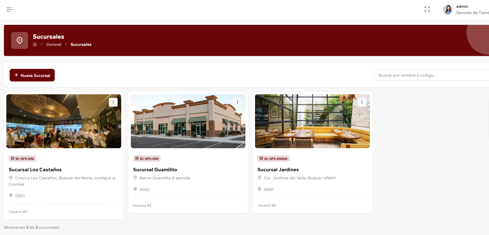
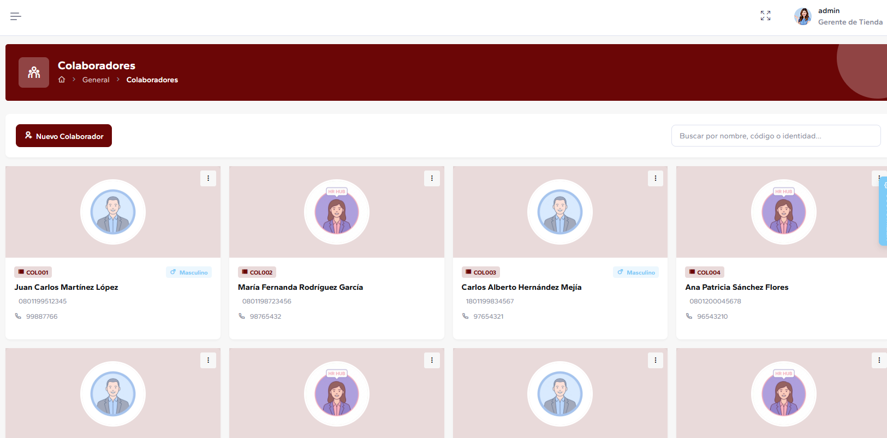
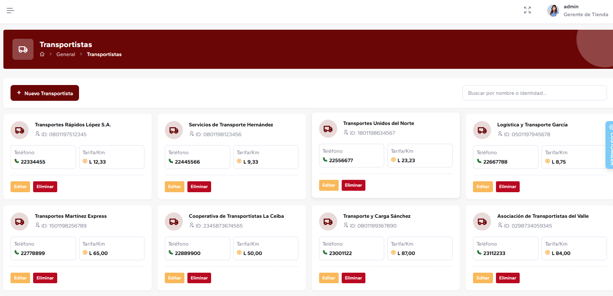
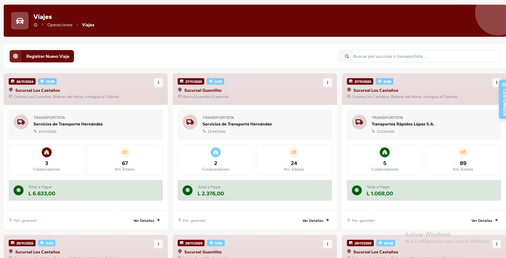
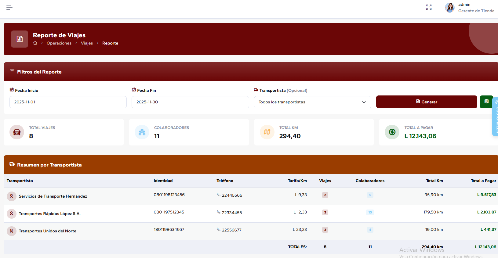

# Sistema de Viajes - Frontend

Sistema integral de gestión de viajes desarrollado con Angular 18. Esta aplicación proporciona una solución completa para la logistica de transporte de colaboradores entre distintas sucursales de una empresa.


## Capturas de Pantalla

### Gestión de Sucursales


### Gestión de Colaboradores


### Gestión de Transportistas


### Gestión de Viajes


### Reportes de Viajes


## 📋 Tabla de Contenidos

- [Características Principales](#-características-principales)
- [Tecnologías Utilizadas](#-tecnologías-utilizadas)
- [Requisitos Previos](#-requisitos-previos)
- [Instalación](#-instalación)
- [Configuración](#-configuración)
- [Ejecución](#-ejecución)
- [Estructura del Proyecto](#-estructura-del-proyecto)
- [Módulos del Sistema](#-módulos-del-sistema)
- [Despliegue](#-despliegue)

## ✨ Características Principales

### 🔐 Autenticación y Seguridad
- Sistema de autenticación basado en JWT
- Guards de ruta para protección de rutas
- Gestión de sesiones

### 📊 Gestión Administrativa
- **Sucursales**: Administración de múltiples sucursales
- **Colaboradores**: Gestión de empleados y colaboradores
- **Transportistas**: Base de datos completa de transportistas

### 🗺️ Operaciones 
- **Viajes**: Control operativo de viajes

### 🎨 Interfaz de Usuario
- Diseño moderno y responsivo
- Múltiples layouts (vertical, horizontal, topbar)
- Temas personalizables
- Dashboard con gráficos interactivos
- Componentes UI avanzados

### 📈 Visualización de Datos
- Reporte detallado de viajes

## 🛠️ Tecnologías Utilizadas

### Core Framework
- **Angular 18.0.3**: Framework principal
- **TypeScript 5.4.5**: Lenguaje de programación

### UI/UX
- **Bootstrap 5.3.5**: Framework CSS
- **SCSS**: Preprocesador CSS
- **FontAwesome 6.7.2**: Iconografía
- **Lordicon**: Iconos animados

### Estado y Datos
- **NgRx**: Gestión de estado (Store, Effects, DevTools)
- **ngx-translate**: Internacionalización
- **RxJS**: Manejo de streams de datos

### Componentes y Bibliotecas
- **ng-select**: Selectores avanzados
- **ngx-toastr**: Notificaciones
- **SweetAlert2**: Alertas personalizadas
- **ngx-spinner**: Indicadores de carga
- **Flatpickr**: Selector de fechas
- **ng-apexcharts**: Gráficos interactivos
- **ngx-echarts**: Gráficos estadísticos
- **FullCalendar**: Gestión de calendarios


## 📦 Requisitos Previos

Antes de comenzar, asegúrate de tener instalado:

- **Node.js**: Versión 23.x o superior
- **npm**: Versión 9.x o superior (incluido con Node.js)
- **Angular CLI**: Versión 18.x

```bash
# Verificar versiones instaladas
node --version
npm --version
ng version
```

## 🚀 Instalación

### 1. Clonar el Repositorio

```bash
git clone https://github.com/tuusuario/SistemaViajes-Frontend.git
cd SistemaViajes-Frontend/Admin
```

### 2. Instalar Dependencias

```bash
npm install
```

> **Nota**: Si encuentras errores de memoria durante la instalación, el proyecto está configurado para usar `--max-old-space-size=8192` en el script de inicio.

### 3. Configurar Cloudinary (Opcional)

Si necesitas funcionalidad de carga de imágenes, configura tus credenciales de Cloudinary en `src/environments/environment.ts`:

```typescript
cloudinaryCloudName: 'tu-cloud-name',
cloudinaryUploadPreset: 'tu-upload-preset',
```

## ⚙️ Configuración

### Archivo de Entorno - Development

Edita `src/environments/environment.ts`:

```typescript
export const environment = {
  production: false,
  defaultauth: 'fakebackend',
  apiUrl: 'https://sistema-viajes-api.onrender.com',
  // Para desarrollo local, descomenta:
  // apiUrl: 'https://localhost:7228',
  apiKey: 'your-api-key',
  
  // Cloudinary configuration
  cloudinaryCloudName: 'your-cloud-name',
  cloudinaryUploadPreset: 'your-preset',
  
  // Firebase configuration (si se usa)
  firebaseConfig: {
    // Tu configuración de Firebase
  }
};
```

### Archivo de Entorno - Production

Para producción, edita `src/environments/environment.prod.ts` con tus configuraciones de producción.

## 🎯 Ejecución

### Servidor de Desarrollo

```bash
npm start
```

La aplicación estará disponible en `http://localhost:4200/`. La aplicación se recargará automáticamente si realizas cambios en los archivos fuente.

### Build de Producción

```bash
npm run build
```

Los artefactos de compilación se almacenarán en el directorio `dist/`.


## 📁 Estructura del Proyecto

```
Admin/
├── src/
│   ├── app/
│   │   ├── account/           # Módulo de autenticación
│   │   ├── pages/
│   │   │   ├── general/       # Gestión general (clientes, sucursales, etc.)
│   │   │   ├── oper/          # Operaciones (viajes)
│   │   │   ├── paquete/       # Paquetes turísticos
│   │   │   ├── vuelo/         # Gestión de vuelos
│   │   │   ├── hotel/         # Gestión de hoteles
│   │   │   ├── restaurante/   # Gestión de restaurantes
│   │   │   ├── dashboards/    # Tableros de control
│   │   │   └── ...
│   │   ├── layouts/           # Layouts de la aplicación
│   │   ├── core/              # Servicios core, guards, interceptores
│   │   ├── models/            # Modelos de datos
│   │   ├── shared/            # Componentes compartidos
│   │   ├── store/             # NgRx store
│   │   └── website/           # Sitio web público
│   ├── assets/
│   │   ├── images/            # Imágenes
│   │   ├── scss/              # Estilos SCSS
│   │   └── ...
│   └── environments/          # Configuraciones de entorno
├── angular.json               # Configuración de Angular
├── package.json               # Dependencias del proyecto
└── tsconfig.json              # Configuración de TypeScript
```

## 🎨 Módulos del Sistema

### 1. **General** (`/general`)
Módulos de gestión administrativa:

- **Colaboradores**: Gestión de colaboradores con avatares
- **Sucursales**: Gestión de sucursales con vista de tarjetas
- **Transportistas**: Gestión de transportistas

### 2. **Operaciones** (`/oper`)
Gestión operativa:

- **Viajes**: Control y seguimiento de viajes
- **Reportes**: Generación de reporte de viajes detallados


## 👥 Autores

- **Oscar Valdivieso** - Sistema de Viajes

